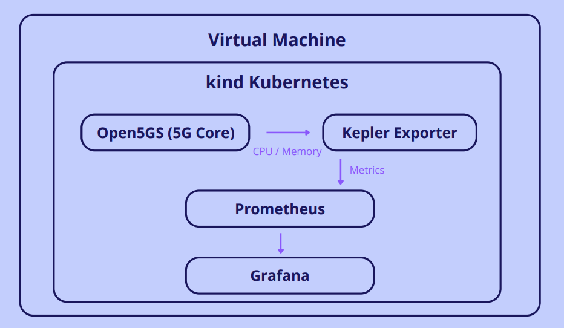
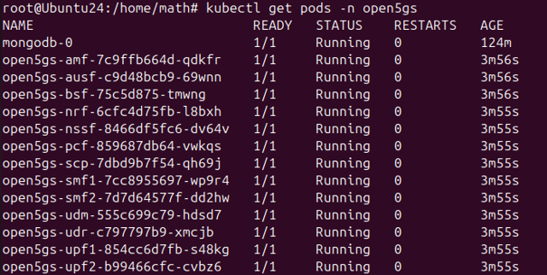
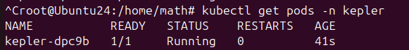
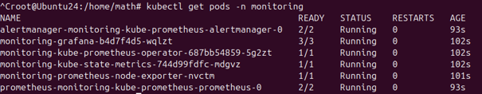
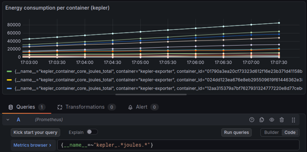

# Open5GS Energy Monitoring

## Overview

This project explores the deployment of a cloud-native 5G Core Network using Open5GS on a Kubernetes cluster.

The objective was to study both the operation of a virtualized 5G core and the energy consumption of cloud-native network functions through monitoring and observability tools.

## Architecture

The project was deployed on a virtual machine using a Kubernetes cluster created with kind.

Open5GS was used as the 5G Core Network, while Kepler, Prometheus and Grafana were used to collect, store and visualize energy consumption metrics.

## Technologies

| Technology | Purpose |
|------------|---------|
| Open5GS | 5G Core Network |
| Kubernetes (kind) | Container orchestration |
| Docker | Containerization |
| Prometheus | Metrics collection |
| Grafana | Metrics visualization |
| Kepler | Energy consumption monitoring |

## Objectives

- Deploy a virtualized 5G Core Network
- Understand cloud-native telecom architectures
- Monitor infrastructure and application metrics
- Analyze energy consumption of Kubernetes workloads
- Visualize metrics through Grafana dashboards

## Deployment Results

### Open5GS Network Functions

All Open5GS network functions were successfully deployed and running inside the Kubernetes cluster.

### Kepler Deployment

Kepler was deployed to collect energy consumption metrics from Kubernetes workloads.

### Monitoring Stack

Prometheus and Grafana were deployed to collect, store and visualize infrastructure metrics.

### Energy Consumption Dashboard

Grafana dashboards were used to visualize energy consumption metrics collected by Kepler.

## Learning Outcomes

Through this project, I gained practical experience with:

- Kubernetes administration
- Containerized network functions
- Monitoring and observability
- Cloud-native architectures
- Telecom infrastructure virtualization
- Energy monitoring of cloud-native workloads
